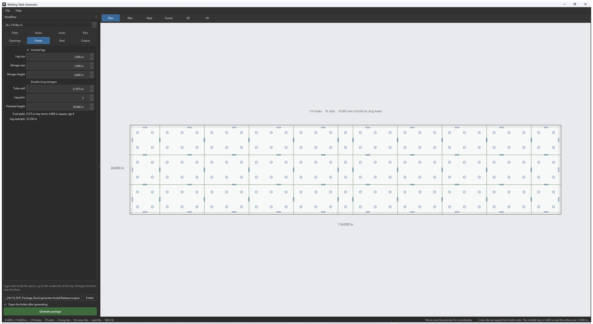
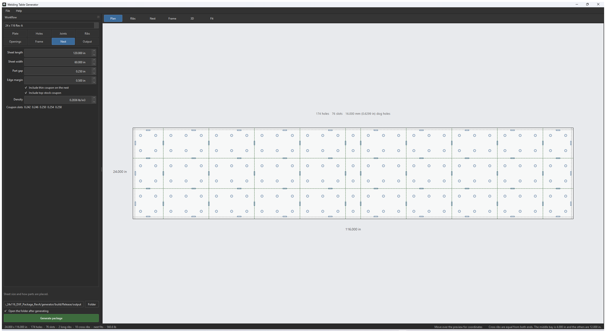
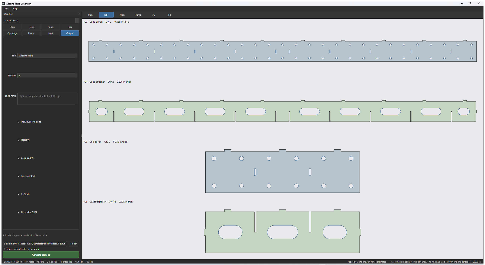
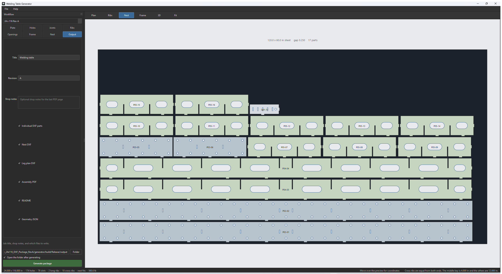
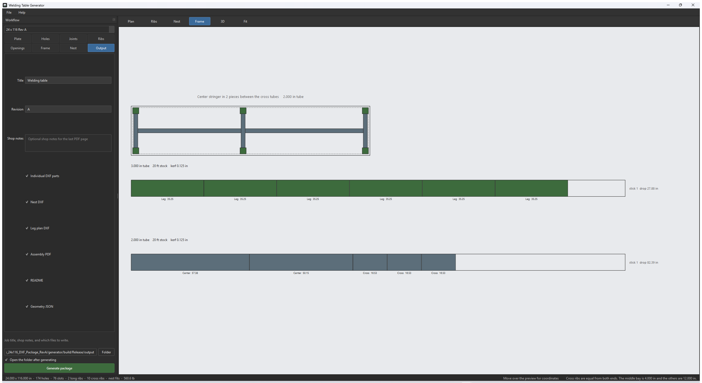
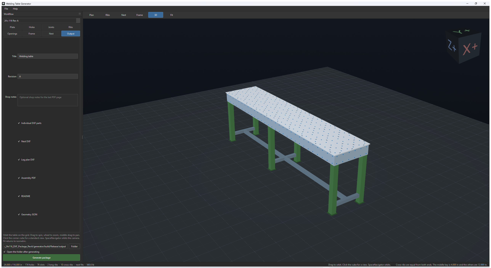

# Welding Table Generator

This program builds a welding table from the sizes you type. The preview updates as you edit. **Generate package** writes the laser-cut DXF files, a sheet nest, a leg plan, and a fabrication PDF.

Design dimensions are inches. Dog-hole diameter is the one size you can enter in millimeters or inches. DXF coordinates are inches, full size. Cut only the layers `CUT_OUTER` and `CUT_INNER`.

The pictures below are the 24 × 116 Rev A starting table.

## The window

The window has four regions.

- **File** and **Help** are in the menu bar. File saves or loads a settings file, generates the package, or exits. Help opens a short About note.
- **Workflow**, on the left, is where you size the table. The dropdown at the top is the starting size. The eight buttons under it are the settings pages. The hint under the form tells you what the field under the pointer does. The folder path, **Open the folder after generating**, and **Generate package** stay visible on every page.
- The **view bar** above the drawing switches the preview: Plan, Ribs, Nest, Frame, 3D, and Fit.
- The **status bar** shows a one-line summary, the coordinate under the pointer, and either Ready or the first warning.

The summary for the starting table reads:

`24.000 x 116.000 in · 174 holes · 76 slots · 2 long ribs · 10 cross ribs · nest fits · 560.6 lb`

That weight is the plate, apron, rib, and foot-plate steel. Tube, welds, and the fit coupons are not in it. If a value cannot be built, the summary turns red and the status line says why.

Hover or click a field to replace the hint. The starting hint on Plate is “Top size and stock thickness.”

**Ctrl+Enter** generates the package from anywhere in the window.

## Starting sizes

The dropdown offers three starting tables. Choosing one fills the form and rebuilds the preview. The first edit you make switches the dropdown to **Custom**. Your last settings are restored the next time the program opens.

| Preset | Top |
| --- | --- |
| 24 x 116 Rev A | 24 in wide, 116 in long. This is the table in the pictures. |
| 36 x 72 | 36 × 72 in. Everything else stays at the Rev A values until you change it. |
| 48 x 96 | 48 × 96 in. Same rule. |
| Custom | Whatever you have edited. |

**File > Save settings...** writes the current form to a JSON file. **File > Load settings...** reads one back. The package itself also writes `Job_Settings.json`, which loads the same way.

## Plate

Plate sets the top and the apron stock.

| Field | Rev A | What it does |
| --- | --- | --- |
| Length | 116 in | Overall top length, along X. The plan labels this under the plate. |
| Width | 24 in | Overall top width, along Y. The plan labels this at the left. |
| Top thickness | 0.375 in | Top plate. Foot plates are cut from this same thickness. Top tabs must be shorter than the plate, or there is nothing left at the working face. |
| Web thickness | 0.236 in | Apron and rib stock. Slot width is this thickness plus the slot clearance on Joints. |
| Web depth | 6 in | How far the apron and ribs hang below the underside of the top. |

## Holes

Dog holes are drilled through the top on a rectangular grid, and the same diameter is used for the apron dog holes.

| Field | Rev A | What it does |
| --- | --- | --- |
| Diameter | 16.000 mm | Hole diameter. The box beside it is **mm** or **in**. |
| Pitch X | 4 in | Spacing along the length. |
| Pitch Y | 4 in | Spacing across the width. |
| Margin X | 2 in | Inset of the first and last hole from the ends. |
| Margin Y | 2 in | Inset of the first and last hole from the front and back edges. |
| Square grid | on | Y pitch and Y margin follow X. Turn it off to set them separately. |

Switching **mm** to **in** converts the number you already have. 16 mm becomes 0.6299 in. A 5/8 in dog is 0.625 in. Switching back to mm converts the other way, so the hole does not jump unless you type a new number. The plan caption shows both units, with the unit you are editing first. On the starting table that caption is `174 holes  76 slots  16.000 mm (0.6299 in) dog holes`.

Pitch and margins stay in inches. The rest of the table is laid out in inches.

Holes that would overlap produce a warning in the status bar. Widen the pitch or reduce the diameter.

## Joints

Joints control how the ribs and aprons lock to each other and to the top.

| Field | Rev A | What it does |
| --- | --- | --- |
| Apron inset | 0.500 in | How far the outer face of the apron sits in from the edge of the top. Zero puts the apron flush with the edge. |
| Apron slots in the top | on | Cuts a slot in the top for each apron tab. With a flush apron, that slot opens through the plate edge. Turn this off to omit those tabs and slots. |
| Slot clearance | 0.010 in | Extra slot width over the web thickness. The slot is stock plus this clearance. |
| Tab width | 1.000 in | Width of a top tab along the rib. |
| Extra slot length | 0.020 in | Extra slot length over the tab, or over an end tab. |
| Top tab height | 0.300 in | How far the top tabs project up into the top plate. On 0.375 in plate this leaves 0.075 in of steel at the working face. |
| End tab length | 0.200 in | How far a rib end tab projects through the apron. |
| End tab height | 1.000 in | Height of that end tab, centered on the web depth. |
| Rib end gap | 0.010 in | Gap between the end of a rib and the inner face of the apron. |
| Half-lap extra | 0.005 in | Each half-lap passes mid-depth by this amount. The two laps together have twice this clearance. |
| Apron dog holes | on | Two rows of dog holes in the long aprons and the end aprons, the same diameter as the top holes. |
| Hole from top | 1.000 in | How far those apron holes sit below the underside of the top. |
| Hole from bottom | 1.000 in | How far they sit above the bottom edge of the web. |

Half-laps on the long ribs open downward. Half-laps on the cross ribs open upward, toward the top. The assembly notes in the generated README say the same thing.

## Ribs

Ribs are placed on the hole grid, not at an arbitrary inch. The spacing you type is a request. The program picks hole midlines at that spacing, the same distance from both ends, and puts any leftover bay in the center.

| Field | Rev A | What it does |
| --- | --- | --- |
| Cross rib spacing | 12 in | Cross ribs run across the width. On the 116 in table they land on a 12 in rhythm with a 4 in bay in the middle. The status line says so: “Cross ribs are equal from both ends. The middle bay is 4.000 in and the others are 12.000 in.” |
| Long rib spacing | 8 in | Long ribs run the length of the table. On a 24 in width they sit at 8 in and 16 in. |

The dashed lines on the plan are those rib centerlines. If the top is too narrow or the pitch is too coarse to place a rib, the status line says no cross ribs were placed.

There is a second **Ribs** button, in the view bar. That one draws the cut profiles. It is described under Views.

## Openings

Lightening openings are the rounded cutouts in the rib bays. They reduce weight. They are not dog holes.

| Field | Rev A | What it does |
| --- | --- | --- |
| Cut lightening openings | on | Turn the cutouts on or off. |
| Opening height | 2 in | Height of each opening. The end radius is half of this. |
| Max length | 6 in | Longest a single opening may be. A long bay is split into several openings. |
| Min length | 2 in | Shortest opening that will be cut. A shorter leftover is omitted. |
| Gap between | 2 in | Steel left between openings in the same bay. |
| Snap | 0.500 in | Opening lengths are rounded to this step. |
| Wide-bay land | 3 in | Steel left on each side of the openings when the bay is wide. |
| Narrow-bay land | 1.750 in | Steel left on each side when the bay is narrow. |
| Wide-bay from | 10 in | A bay at least this wide uses the wide land. A shorter bay uses the narrow land. |

The weight removed shows up in the PDF as “Lightening removes about … lb.” The status-bar weight is the steel that is left, plus the foot plates.

## Frame

The frame is the legs and the tubes that tie them. It is a reference plan and a saw list. It is not a laser-cut DXF of the tube.

| Field | Rev A | What it does |
| --- | --- | --- |
| Include legs | on | Turns the frame on. The leg plan, the foot plates, and the tube nest all depend on this. |
| Leg size | 3 in | Outside size of the leg tube. Legs stand inside the apron and run up to the underside of the top, so there is a vertical face to weld to. |
| Stringer size | 2 in | Outside size of the stringer tube. It cannot be larger than the leg. If you raise the leg size, the stringer maximum follows it. |
| Stringer height | 4 in | Height from the floor to the bottom of the stringers. |
| Double long stringers | off | Off: one center stringer, cut into pieces that fit between the cross tubes. On: a stringer at the front and a stringer at the back, so a shelf can sit on the rectangle, with the cross tubes between them. |
| Tube wall | 0.1875 in | Wall thickness printed on the plan. 0.1875 in is 3/16 in. It is a note, not a change to the outside size. |
| Leg pairs | 3 | Pairs of legs along the table, counting both ends. The two end pairs sit in the apron corners. Each intermediate pair is moved to a corner where a cross rib meets the apron, in a bay wide enough for the leg, so the leg is not buried in a rib. |
| Finished height | 36 in | Height of the working face above the floor. |
| Foot plate | computed | Square plate, leg size plus 1 in, cut from the top thickness. Rev A is 0.375 in stock, 4 in square, quantity 6. |
| Leg example | computed | Leg tube length. It is finished height, minus the top, minus the foot plate. Rev A is 35.250 in. |

End cross tubes are centered on the end legs, not flush to a face. The long stringer stops at the inside face of those tubes, so it does not stick out past the legs.

Tube is nested on 20 ft or 24 ft sticks. The kerf between cuts is 0.125 in. The program buys whichever length uses less stock. The nest is drawn on the Frame view and printed in the PDF. There is no separate tube-nest DXF.

## Nest

The nest packs the thin-stock parts (aprons, ribs, and the thin coupon) onto a sheet.

| Field | Rev A | What it does |
| --- | --- | --- |
| Sheet length | 120 in | Long axis of the sheet. |
| Sheet width | 60 in | Short axis of the sheet. |
| Part gap | 0.250 in | Minimum gap between part boxes. |
| Edge margin | 0.500 in | Keep-out inside the sheet edge. |
| Include thin coupon on the nest | on | Puts Q01 on the thin-stock sheet with the production parts. |
| Include top-stock coupon | on | Writes Q02 as its own DXF. It is not placed on the thin sheet, because it is top-plate thickness. |
| Density | 0.2836 lb/in³ | Steel density used for the weight estimate. |
| Coupon slots | computed | Five slot widths to cut on the coupon, left to right: design slot width minus 0.004, the design width, then plus 0.004, 0.008, and 0.012 in. Rev A web is 0.236 in plus 0.010 in clearance, so the design slot is 0.246 in and the five widths are 0.242, 0.246, 0.250, 0.254, and 0.258 in. |

If the parts do not fit, the status summary says “nest does not fit” and the Nest view shows the reason. A sheet that is too narrow splits the nest across more than one sheet. Each extra sheet becomes another DXF and another PDF page.

Use either the nest DXF or the individual thin-part DXFs at the laser, not both. The top and the foot plates are thicker stock and are never placed on the thin-sheet nest.

## Output

| Field | Rev A | What it does |
| --- | --- | --- |
| Title | Welding table | Printed on the PDF and in the README. |
| Revision | A | Letter used in the PDF file name. |
| Shop notes | empty | Optional text added to the last PDF page. |
| Individual DXF parts | on | One DXF per part. The origin is shifted so the coordinates are not negative. |
| Nest DXF | on | The thin-stock nest. Extra sheets are `N02`, `N03`, and so on. |
| Leg plan DXF | on | `R01`, the leg and stringer plan. Reference only. No cutting layers. |
| Assembly PDF | on | The fabrication packet. |
| README | on | Cutting and assembly notes. |
| Geometry JSON | on | `Geometry_Checks.json` and `Job_Settings.json`. |

Under the form, on every page:

- The path is the folder the package is written into. **Folder** browses for it. A new install uses an `output` folder next to the program.
- **Open the folder after generating** opens that folder when the write succeeds.
- **Generate package** writes the files. The button is also **Ctrl+Enter**.

## Views

The view buttons do not change the design. They change the drawing. Fit puts the current drawing back in the window. On the 3D view, Fit returns to the isometric camera.

Wheel zoom and drag-to-pan work on Plan, Ribs, Nest, and Frame. The coordinate readout at the right of the status bar follows the pointer and is in inches.

### Plan

Plan is the view in the settings pictures above. Changing a settings page does not change the view, which is why this picture still shows the top while Output is selected. You are looking down on the plate.

- The outer rectangle is the plate.
- Circles are dog holes.
- Small rectangles are tab slots.
- Dashed lines are apron faces and rib centerlines.
- The caption under the plate is the hole count, the slot count, and the dog-hole diameter.

### Ribs

Ribs draws each cut profile at full scale, one under another, with the quantity and the stock thickness.

- **P02 Long apron** is the pair of long sides. Dog holes run along it, and the end tabs of the cross ribs land in it.
- **P04 Long stiffener** is the pair of long ribs, with lightening openings and half-laps.
- **P03 End apron** is the pair of short ends.
- **P05 Cross stiffener** is a cross rib. Rev A needs 10 of them.

The top plate, the coupons, and the foot plates are in the individual DXF files. They are not stacked in this view.

### Nest

Nest shows the thin-stock sheet, Rev A on one 120 × 60 in sheet with a 0.250 in gap and 17 profiles. Aprons are the blue-gray parts. Ribs are green. Each copy is labeled, for example `P05-01`.

The border of the sheet is not a cut. Labels are not a cut. In the DXF those live on `REF_NO_CUT` and `LABEL_NO_CUT`.

### Frame

The top of this view is the leg plan, looking down. Legs are green. Stringers are blue-gray. The caption states whether you have one center stringer, cut into pieces between the cross tubes, or two shelf stringers.

Under the plan, each tube size gets a saw nest:

- A heading gives the tube size, the stock length (20 ft or 24 ft), and the 0.125 in kerf.
- Each colored block is one cut. The name and the length sit under the block. A short cross tube drops to a second line so its label does not run into the piece beside it.
- The white tail of the stick is drop. The note at the right is the stick number and the drop length.

Rev A puts six 35.25 in legs on one 20 ft stick of 3 in tube, and the center-stringer pieces plus the cross tubes on one 20 ft stick of 2 in tube.

### 3D

3D puts the assembled table on a grid floor, in isometric, with the working face up.

| Action | Result |
| --- | --- |
| Drag with the left button | Orbit |
| Scroll wheel | Zoom |
| Drag with the middle button | Pan |
| Click a face of the corner cube | Jump to that standard view. The cube faces are marked, for example X+ and Z+. |
| SpaceNavigator | Orbit the camera |
| Fit | Return to isometric |

Dog holes are drawn on the top and on the apron faces. The blue ring is the rim of the hole marker. The dark center is the hole. They are drawn on the faces so the solid view stays readable. They are not a second set of geometry.

Legs are green and run from the foot plate up to the underside of the top. Stringers are the lighter tubes near the floor.

## What Generate package writes

Files land in the folder under the form. Names use the revision and the sizes. For the starting table the DXF folder contains:

| File | Stock | Cut it? |
| --- | --- | --- |
| `P01_Top_…` | Top thickness | Yes. Outside profile, dog holes, and tab slots. |
| `P02_Long_apron_…` | Web thickness, quantity 2 | Yes. |
| `P03_End_apron_…` | Web thickness, quantity 2 | Yes. |
| `P04_Long_stiffener_…` | Web thickness, quantity 2 | Yes. |
| `P05_Cross_stiffener_…` | Web thickness | Yes. Quantity follows the rib layout. Rev A is 10. |
| `Q01_Thin-stock_fit_coupon_…` | Web thickness | Yes, first. Five slot widths and a sample tab. |
| `Q02_Top-stock_fit_coupon_…` | Top thickness | Yes, if you left the top coupon on. It is not on the thin nest. |
| `F01_Foot_plate_…` | Top thickness | Yes. One square per leg. |
| `N01_…_Sheet_Nest` | Web thickness | Yes, instead of the individual P02–P05 and Q01 files. |
| `R01_Tube_Frame_Plan_REFERENCE_ONLY` | none | No. Plan only. |

DXF layers:

| Layer | Use |
| --- | --- |
| `CUT_OUTER` | Outside profile |
| `CUT_INNER` | Holes, slots, and openings |
| `REF_NO_CUT` | Sheet border, leg plan, construction |
| `LABEL_NO_CUT` | Text |

The file version is AutoCAD 2004 (`AC1018`). Units in the file are inches. Apply kerf in the CAM software. The geometry is the finished size.

Also written beside the DXF folder:

- `Welding_Table_<width>x<length>_Assembly_Rev<letter>.pdf` — isometric, coordinates, rib profiles, the nest, the leg plan and tube nest, and the bill of materials.
- `README_Cutting_and_Assembly.md` — the sizes you chose, the file list, the coupon widths, and the assembly order.
- `Geometry_Checks.json` — the counts the program checked.
- `Job_Settings.json` — reload this from File > Load settings to get the same table back.

## A sensible first cut

1. Leave the coupon checks on. Generate the package.
2. Cut Q01 and try a real tab in each of the five slots. Try a real dog in a hole.
3. Then cut either the nest or the individual apron and rib files.
4. Cut the top and the foot plates from the thicker stock.
5. Saw the tube from the nest on the Frame view, or from the same picture in the PDF.
6. Assemble the cage, dry-fit every top tab, then weld. Legs weld to the inside of the apron and up to the underside of the top.

The program does not supply a load rating, a weld schedule, or a flatness callout.
